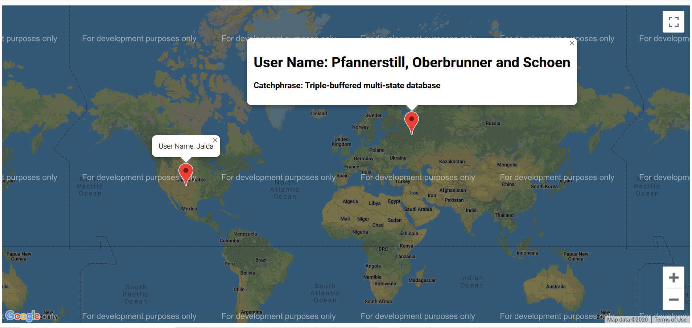

# Maps

## Intro

Basic, starter, typescript application that randomly generates a company and a user, both with random latitude and longitude properties, and some other random information provided by the faker package. Each one is shown in a google map with a location marker, and each marker can be clicked to open a pop-up describing what each one is.

## Tech stack

- Parcel (web application bundler) - defaults to [localhost:1234](http://localhost:1234/)
- Typescript 3.9.5
- Faker 4.1.0

## Getting started

- Run `npm install -g parcel-bundler` to install Parcel globally if you don't already have it.
- Run `parcel index.html` to start the project
- Navigate to localhost:1234
- You should see a map of the world with two markers on it.
- Click on each marker to see the pop-up.

## Screenshot

